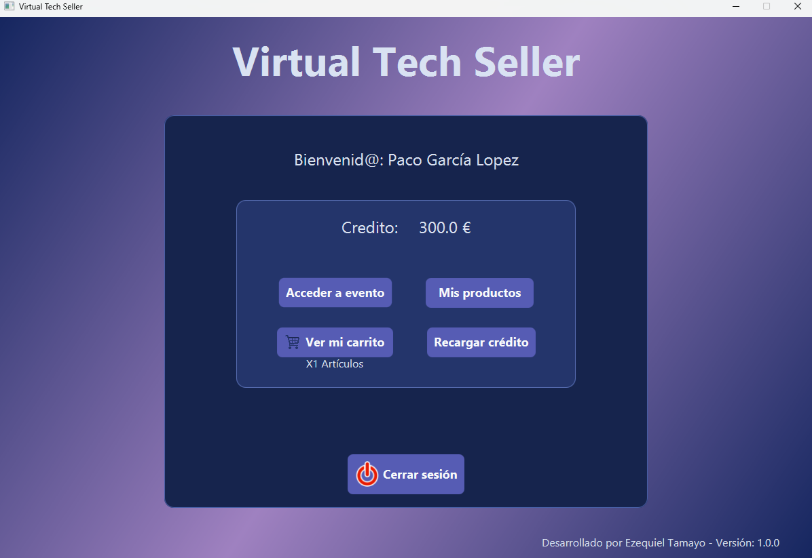
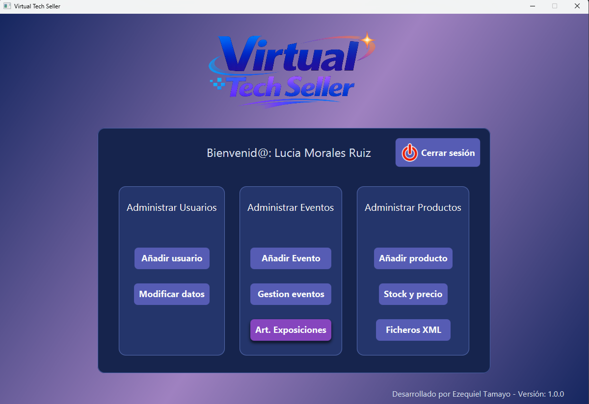
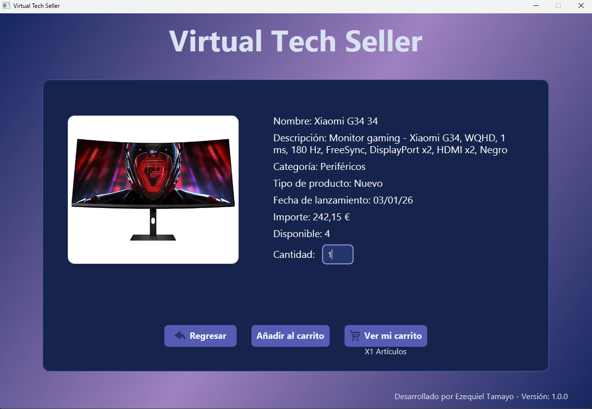

# Virtual Tech Seller


---
**Virtual Tech Seller** es una aplicación multiplataforma diseñada para la gestión integral de ventas de artículos tecnológicos a través de un sistema de "Exposiciones" o eventos temporales. 

Este proyecto se ha desarrollado como parte del **Proyecto Intermodular de 1º de DAM**, integrando conocimientos de Programación, Bases de Datos, Lenguajes de Marcas, Sistemas Informáticos y Entornos de Desarrollo.


## ¿Qué problema resuelve? (Propósito de la App)

En el mercado actual, las tiendas de tecnología manejan catálogos mixtos (productos nuevos y reacondicionados/usados) y organizan eventos temporales de ventas (tipo *Black Friday*, *Gaming Week*). **Virtual Tech Seller** resuelve la necesidad de centralizar esta operativa empresarial, permitiendo:

- **Gestión de inventario mixto:** Diferencia a nivel de negocio y base de datos entre productos nuevos (gestión de stock y fecha de lanzamiento) y usados (descuentos dinámicos y estado físico del hardware).
- **Control de accesos y roles:**
   * **Administradores:** Controlan el catálogo, habilitan exposiciones y gestionan usuarios así como altas/bajas.
   * **Moderadores:** Analizan métricas de ventas y contabilizan visitas de usuarios a cada evento.
   * **Clientes:** Exploran catálogos interactivos, recargan su crédito de compra y añaden productos a su carrito.
- **Gestión de concurrencia en compras:** El sistema evita que dos clientes compren el mismo artículo con stock limitado al mismo tiempo, actualizando el carrito al stock disponible.
- **Seguridad:** Las contraseñas se almacenan mediante encriptación (BCrypt) para asegurar la privacidad del usuario.


## Tecnologías Usadas

El proyecto está construido bajo una arquitectura modular usando las siguientes tecnologías:

* **Lenguaje:** Java (Uso de POO: herencia, polimorfismo, interfaces).
* **Base de Datos:** MariaDB / MySQL (Modelo relacional normalizado).
* **Conectividad:** JDBC (Java Database Connectivity).
* **Intercambio de Datos:** XML y XSD mediante JAXBind (Para importación/exportación validada del catálogo de productos).
* **Control de Versiones:** Git y GitHub.
* **Modelado y Diseño:** PlantUML (Diagramas de Clases) y Draw.io/Word (Modelado ER y Relacional).

## Estructura del Repositorio

El proyecto sigue una estructura de directorios profesional para separar el código fuente de la documentación y los scripts de base de datos:

```text
/
├── src/                # Código fuente Java (Modelos, Controladores, Servicios, Repositorios)
├── sql/                # Scripts de base de datos (DDL de creación, DML de datos, DCL y consultas)
├── xml/                # Archivos XML de exportación de catálogo y esquemas de validación (XSD)
├── docs/               # Documentación del proyecto
│   ├── entornos/       # Acta de reunión y análisis de requisitos con el cliente
│   ├── img/            # Capturas de pantalla de la aplicación y evidencias gráficas
│   ├── bbdd/           # Diagramas ER, relacional y modelo de datos
│   ├── uml/            # Diagramas de clases (PlantUML)
│   ├── sistemas/       # Informe técnico del entorno de ejecución
│   └── empleabilidad/  # Perfil profesional e investigación del sector
└── README.md           # Este archivo con documentación general

```

## Instrucciones de Instalación y Ejecución

Para desplegar el proyecto en un entorno local, sigue estos pasos:

### 1. Clonar el repositorio
```bash
git clone https://github.com/TamezeDev/virtualTechSeller.git
cd virtualTechSeller
```

### 2. Configurar la Base de Datos
1. Abre tu gestor de base de datos (ej. DBeaver, phpMyAdmin o terminal MariaDB).
2. Ejecuta el script `sql/01_schema_DDL.sql` para crear la estructura.
3. Ejecuta el script `sql/02_initial_data_DML.sql` para poblar la base de datos con información de prueba (eventos, usuarios y 20 productos de hardware).
4. Ejecuta el script `sql/users_roles.sql` para generar los usuarios y los roles con sus permisos y asignaciones correspondientes.

### 3. Ejecución de la Aplicación
 - Ejecuta directamente la clase `Main.java` para arrancar la interfaz de la aplicación desde un IDE como IntelliJ.
 -  Descargar el archivo ejecutable (`virtualTechSeller.jar`) o compilar el código fuente.
 - Hacer doble clic sobre el archivo `.jar` o ejecutar el siguiente comando en la terminal:
   ```bash
   java -jar virtualTechSeller.jar
   ```
> **Nota:** Puedes iniciar sesión con el usuario administrador de prueba: `admin1@virtualtechseller.com` / `Admin-123`, 
> con un cliente de prueba: `client1@virtualtechseller.com` / `Client-123` o un moderador de prueba `moderator1@virtualtechseller.com` / `Moderator-123`.

## Capturas de Pantalla

| Menú Principal (Cliente) | Menú Principal (Cliente) | Panel de Administración | 
| :---: | :---: | :---: |
|  |  |  | 

| Catálogo de Productos | Análisis de ventas | Detalles del producto |
| :---: | :---: | :---: |
|  |  |  |

*Desarrollado como Proyecto Intermodular (Prometeo by The Power) - 2026*