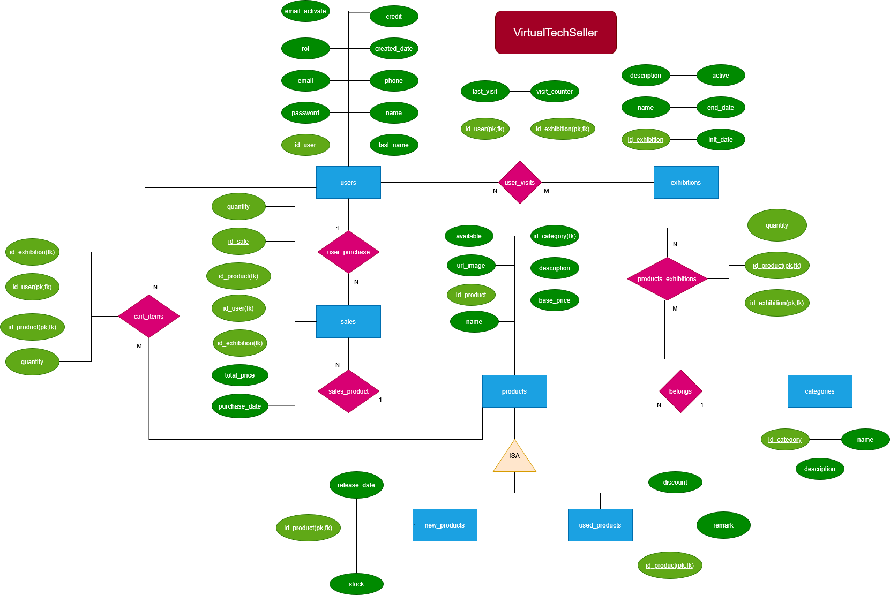
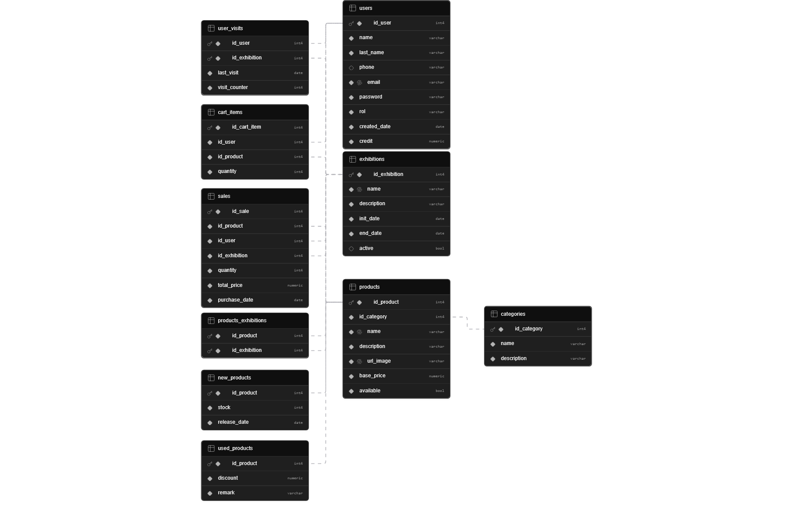

# Base de Datos: Virtual Tech Seller

Este directorio contiene todo el diseño, modelado y scripts SQL para la base de datos del Proyecto Intermodular **Virtual Tech Seller**.

## Análisis de Datos (Requisitos)

A partir de la reunión de toma de requisitos, identificamos que la aplicación debe gestionar una plataforma de venta de artículos tecnológicos (nuevos y usados) mediante exposiciones o eventos temporales. 

### Entidades Principales:
* **Users**: Gestiona los usuarios del sistema. Existen tres roles: `ADMIN` (gestiona la plataforma), `MODERATOR` (analiza métricas de los datos) y `CLIENT` (compra artículos).
* **Products**: Catálogo base de artículos. Se especializa mediante herencia en `new_products` (tienen stock y fecha de lanzamiento) y `used_products` (tienen descuento y estado/observaciones).
* **Categories**: Agrupación lógica de los productos.
* **Exhibitions**: Eventos temporales donde se ponen a la venta lotes de productos. Tienen fecha de inicio, fin y estado de activación.
* **Sales**: Registro histórico de compras. Relaciona qué cliente compró qué producto, en qué evento, cantidad y precio total.
* **Cart_items**: Carrito de compras temporal del cliente.
* **User_visits**: Registro analítico que cuenta cuántas veces un usuario visita una exposición concreta y la fecha de su último acceso.

## Diagrama Entidad-Relación (ER)

El diseño conceptual refleja las entidades, sus atributos y cardinalidades. 
* Un usuario puede realizar muchas compras o ninguna (0:N).
* Un producto pertenece a una sola categoría (1:N).
* Una exposición contiene muchos productos y un producto puede estar en muchas exposiciones (N:M -> `products_exhibitions` - tabla intermedia).
* Los clientes pueden añadir múltiples productos al carrito (N:M -> `cart_items` - tabla intermedia).

## Modelo Relacional

A partir del diagrama E-R, se ha normalizado la base de datos generando las tablas definitivas con sus claves primarias (PK), foráneas (FK) y restricciones de integridad (CHECK, DEFAULT, ...). 

Se ha implementado **integridad referencial** con borrados en cascada (`ON DELETE CASCADE`) para dependencias fuertes (ej. carrito) y borrados restrictivos (`ON DELETE RESTRICT`) para históricos financieros (ej. ventas).

*Puedes consultar el diccionario de datos detallado en el archivo [modelo relacional.docx](./modelo-relacional.docx).*

## Creación e Inserción (Scripts SQL)

La base de datos está construida en **MariaDB / MySQL**. Los scripts se encuentran en la carpeta `../sql/` y deben ejecutarse en este orden:

1. **`01_schema_DDL.sql`**: Crea la base de datos, las tablas, las restricciones (`CHECK`) y los índices de optimización (ej. índice en el email para logins rápidos).
2. **`02_initial_data_DML.sql`**: Carga datos de prueba realistas (categorías, 20 productos de hardware/gaming, 4 exposiciones, clientes, administradores, un carrito y un historial de ventas).
3. **`03_users_roles.sql`**: Script de creación de usuarios a nivel de motor de base de datos con permisos otorgados según su rol (DCL). Es opcional para consultas directas desde PHP_MY_ADMIN pero necesario para uso de la app ya que la conexión se basa en torno al rol del usuario seleccionado.

## Consultas SQL (Queries)

En el archivo **`04_queries.sql`** se encuentran algunas de las consultas que consumirá el backend mediante el conector (JDBC) desarrollado en el módulo de Programación. Se han estructurado según la lógica de negocio:

* **Autenticación**: Uso de `EXISTS` para validación de emails y recuperación de hashes bcrypt de contraseñas.
* **Gestión de Stock**: Consultas `UPDATE` con operaciones matemáticas (`stock = stock - X`) comprobando restricciones de seguridad (evitar stock negativo).
* **Análisis de Moderadores**: `INNER JOIN` complejos entre Usuarios, Visitas y Eventos para métricas de tráfico. Filtros por fechas (`BETWEEN`) y ordenaciones condicionales.
* **Catálogo y Carrito**: Extracción de datos combinando la herencia de productos (`LEFT JOIN` con productos nuevos y usados) para mostrar precios y descuentos dinámicos.

## Integración con el Proyecto Global
Esta base de datos no es un sistema aislado. Sus restricciones de negocio (ej: no se puede borrar un evento si tiene ventas registradas) aseguran la estabilidad de la App Java. Además, el diseño de `new_products` y `used_products` coincide exactamente con la arquitectura de herencia de clases (POO) planteada en el módulo de Entornos de Desarrollo / Programación.