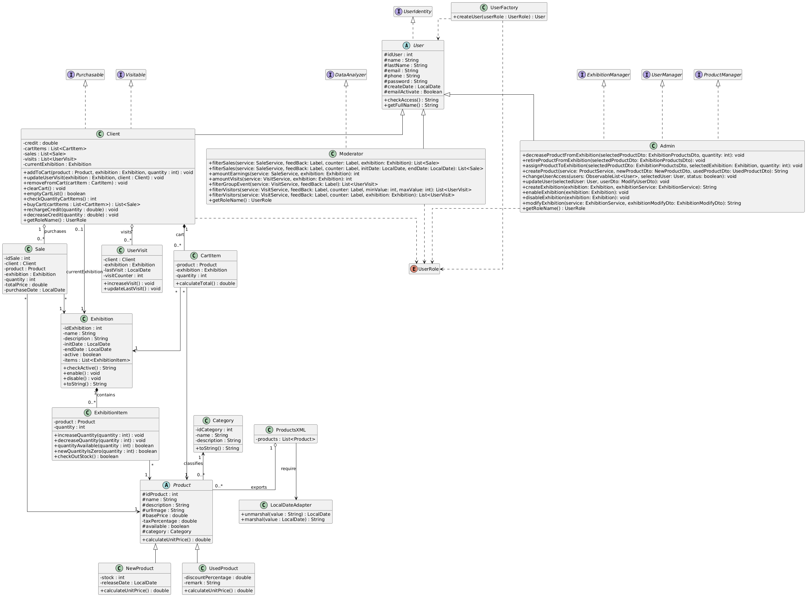

# MPO (Ampliación de Programación) - Virtual Tech Seller

Este directorio documenta la arquitectura avanzada y las mejoras estructurales implementadas en el proyecto **Virtual Tech Seller** para el Módulo Profesional Optativo (MPO). 

Mientras que el módulo de Programación base evalúa la funcionalidad general, esta entrega se centra en la **calidad del código, la mantenibilidad, el diseño orientado a objetos (POO) y la aplicación de Patrones de Diseño**.

## Arquitectura del Proyecto y Patrones de Diseño

El proyecto ha sido estructurado separando estrictamente la interfaz (JavaFX), la lógica de negocio y el acceso a datos. Para gobernar esta arquitectura, se han implementado varios **Patrones de Diseño** reconocidos en la industria:

### Patrón Singleton (Gestión de Estado Global)
Para evitar el alto coste computacional de instanciar repetidamente los servicios y conexiones a la base de datos, se ha implementado el patrón Singleton en dos clases críticas del paquete `app/`:
* **`AppContext`:** Garantiza que solo exista una instancia global que contenga los servicios (`UserService`, `ProductService`, etc.) y el `ConnectionManager`.
* **`SessionManager`:** Asegura que solo pueda existir un usuario autenticado a la vez por cliente en ejecución. Cuando un usuario hace *logout*, la instancia se limpia, garantizando la seguridad del entorno.

### Patrón Factory (Creación Segura de Objetos)
En lugar de instanciar usuarios usando constructores genéricos por toda la aplicación, se ha centralizado la creación mediante la clase **`UserFactory`**. Basándose en el enumerador `UserRole`, la fábrica decide qué subclase concreta (`Admin`, `Moderador`, `Client`) debe instanciarse. Esto respeta el principio *Open/Closed* de SOLID.

### Patrón Observer (Reactividad en la Interfaz)
La comunicación entre los datos de Java y la vista gráfica de JavaFX se realiza utilizando **`ObservableList`**. Al aplicar este patrón, la interfaz gráfica "observa" las colecciones de datos (por ejemplo, el catálogo o el carrito). Si un dato muta en la lógica (por ejemplo, alguien compra un artículo), la vista se entera del cambio instantáneamente y se repinta sin necesidad de recargar la ventana.

*(Se adjunta diagrama de clases de la aplicación)*

## Funcionalidad Extra / Mejora Estructural Implementada

La rúbrica del MPO exige implementar mejoras estructurales respecto a lo que se haría en un nivel básico de programación. En Virtual Tech Seller se han incorporado **múltiples mejoras de alta complejidad**:

### Seguridad y Criptografía (BCrypt)
No se almacena ninguna contraseña en texto plano. La capa de servicios intercepta la creación del usuario e inyecta la librería **BCrypt** para aplicar un "hash" y un "salt" de alta seguridad antes de guardar en MariaDB.

### Transacciones de Base de Datos (Commit / Rollback)
En procesos críticos como efectuar una compra (checkout), se ha abandonado el modo de autoguardado (`autoCommit=true`). Se ha programado en forma de transaccion tal que:
1. Agrupa múltiples sentencias SQL (restar saldo al cliente, restar stock del producto, guardar línea de venta y vaciar carrito).
2. Si **todas** las operaciones tienen éxito, hace un `commit()`.
3. Si **alguna** falla (ej. el cliente se queda sin saldo a mitad de proceso o se cae la red), captura la `SQLException` y hace un `rollback()`, deshaciendo todos los cambios parciales para mantener la base de datos 100% consistente ("Todo o Nada").

### Control de Concurrencia en Tiempo Real
Si un cliente tiene un producto en su carrito, pero antes de pagar, otro cliente compra la última unidad existente, el sistema detecta la colisión mediante el método `setCartItemList()`. Compara el inventario físico con el carrito temporal y, si hay diferencias, actualiza o elimina el ítem del carrito avisando al usuario, evitando ventas en negativo o bloqueos por falta de stock.

### Intercambio e Integración XML
Se ha incorporado un módulo funcional extra que permite a los Administradores **exportar e importar catálogos en formato XML** mediante JAXB, validando los datos con un XSD externo antes de permitir que la información contamine la base de datos de la tienda.

---
**Conclusión:** 
La aplicación demuestra una clara evolución desde un código estructurado básico hacia una **arquitectura en capas mantenible, escalable, segura y regida por principios de diseño profesional**.