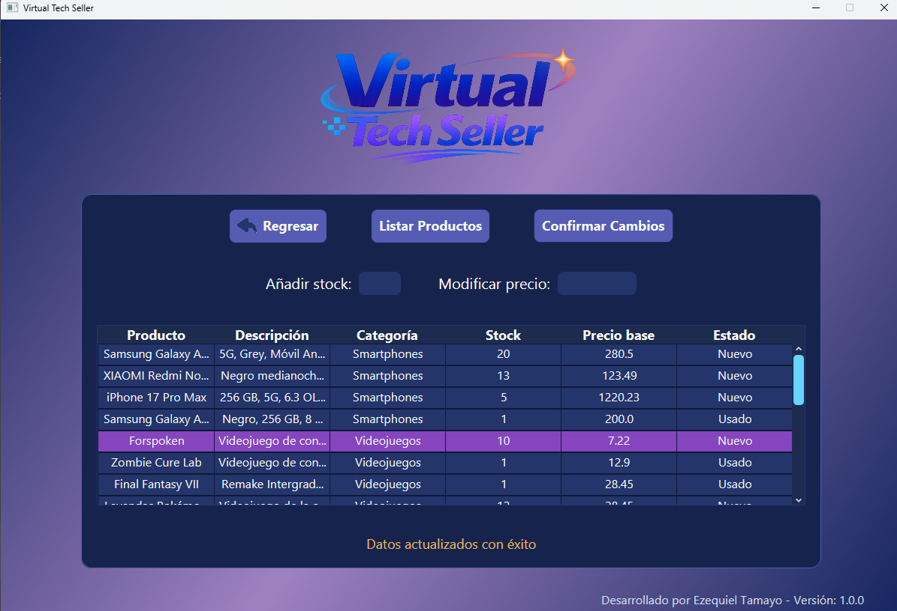
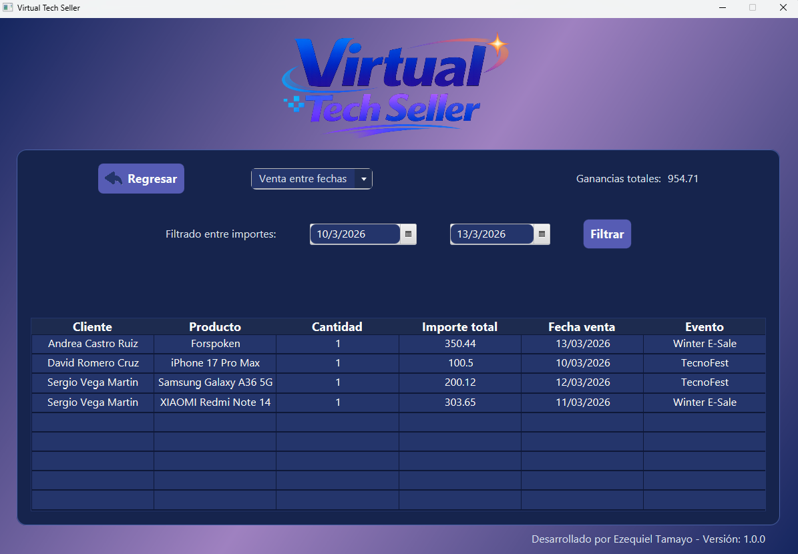
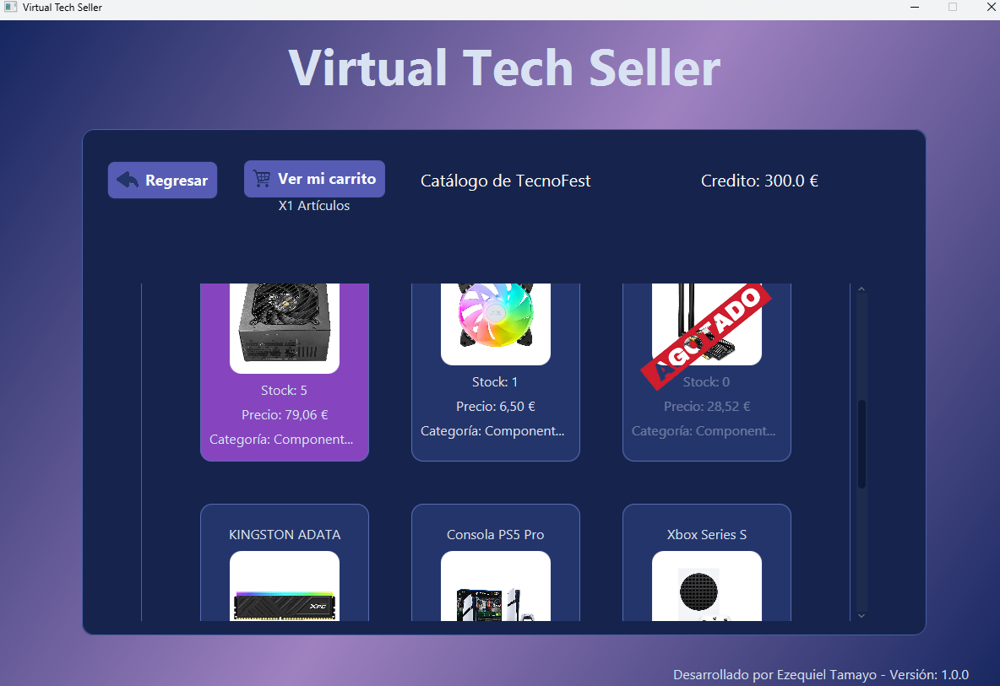

# Informe Técnico de Entorno de ejecución
**Proyecto:** Virtual Tech Seller  
**Módulo:**  Sistemas Informáticos

---

## Definición del Entorno de ejecución

Tras analizar las necesidades del proyecto **Virtual Tech Seller**, se ha determinado que la aplicación tiene una arquitectura Cliente-Servidor de dos capas:
 -  **Servidor Local (Database):** La base de datos relacional (MariaDB) debe ejecutarse de manera centralizada.
 -  **PC de Usuario (Frontend):** La aplicación cliente en Java (interfaz gráfica) se ejecuta localmente en el equipo de escritorio del usuario.

**Justificación:** Se ha elegido un despliegue en un laptop o desktop para la interfaz gráfica porque es una aplicación de escritorio pesada (App desarrollada en Java) que requiere recursos locales de renderizado. Por su parte, centralizar la base de datos asegura que la concurrencia de varios usuarios (por ejemplo, clientes comprando a la vez) se gestione correctamente.

## Requisitos de Hardware

Dado que es una aplicación empresarial en Java con renderizado gráfico y conexión a bases de datos, los requisitos son los siguientes:

### Requisitos Mínimos (PC Cliente)
* **CPU:** Procesador Dual-Core (ej. Intel Core i3 / AMD Ryzen 3) a 2.0 GHz o superior.
* **Memoria RAM:** 4 GB (2 GB consumidos por la JVM y el SO).
* **Almacenamiento:** 500 MB disponibles (para la JRE y archivos de programa).
* **Red:** Conexión a red de área local (LAN) o Internet para conectar con el servidor de Base de Datos.
* **Pantalla:** Resolución mínima de 1280x720 para una correcta visualización de las tablas de datos.
* **Periféricos:** Es necesario uso de ratón y teclado para usar la aplicación.

### Requisitos Recomendados (PC Cliente + Servidor Local)
* **CPU:** Quad-Core (Intel Core i5 / AMD Ryzen 5).
* **Memoria RAM:** 8 GB o superior.
* **Almacenamiento:** 1 GB (SSD recomendado para lecturas rápidas del gestor de Base de Datos y almacenamiento de imágenes y XMLs locales).

## Sistema Operativo Recomendado

* **Sistemas Operativos Compatibles:** Windows 10/11 (64 bits), macOS (Intel o Apple Silicon M1/M2/M3 - macOS 12 o superior) y distribuciones Linux (ej. Ubuntu 22.04 LTS).
* **Justificación:** Al estar desarrollada en Java, la aplicación es nativamente multiplataforma. Puede ejecutarse en cualquier equipo, independientemente de su sistema operativo, siempre y cuando cuente con la Máquina Virtual de Java (JVM) instalada.
* **Nota sobre entornos UNIX (macOS / Linux):** La ejecución de la interfaz gráfica y la lógica de negocio es idéntica a Windows. Sin embargo, para montar el servidor de base de datos MariaDB en macOS, se recomienda utilizar un contenedor Docker o instalarlo vía Homebrew (`brew install mariadb`).
  
## Guía de Instalación y ejecución

Para poner en marcha el sistema, siga estos pasos:

### Entorno de Construcción y Dependencias (Apache Maven)

El proyecto utiliza **Apache Maven** para la gestión de inyección automatizada de dependencias, garantizando una compilación limpia y reproducible sin necesidad de librerías locales externas. 

Se requiere tener instalado el **Java Development Kit (JDK) 25** (o superior), ya que el proyecto está compilado con esta versión del entorno Java.

Las dependencias principales inyectadas mediante el archivo `pom.xml` son:

- **Persistencia y Base de Datos:**
   * `mysql-connector-j` (v9.6.0): Driver JDBC de Oracle para la conexión nativa con la base de datos MariaDB/MySQL.
- **Seguridad y Encriptación:**
   * `bcrypt` de *at.favre.lib* (v0.10.2): Librería especializada en el hasheo seguro de contraseñas de usuario, evitando su almacenamiento en texto plano.
- **Gestión Estructural (XML):**
   * `jaxb-api` (v2.3.1) y `jaxb-runtime` (v2.3.9): Para la arquitectura JAXB (Java Architecture for XML Binding), responsable de la importación, exportación y validación contra esquemas XSD de los catálogos.
   * `jackson-databind` (v3.1.0): Para mapeos estructurales avanzados.
- **Interfaz Gráfica y Utilidades:**
   * `javafx-controls` y `javafx-fxml` (OpenJFX): Motor de renderizado para la aplicación de escritorio y vistas.
   * `lombok` (v1.18.44): Para la reducción de código repetitivo (getters, setters y constructores) en el paradigma de herencia de clases (POO).
  
### Preparación del Servidor
- Iniciar el servicio de MariaDB.
-  Cargar los scripts SQL incluidos en el directorio `/sql` del proyecto:
   * Ejecutar primero `01_schema_DDL.sql` (crea la estructura).
   * Ejecutar segundo `02_initial_data_DML.sql` (carga datos de las tablas).
   * Ejecutar tercero `03_users_roles.sql` (establecer usuarios y roles).

### Ejecución de la Aplicación
1. Descargar el archivo ejecutable (`virtualTechSeller.jar`) o compilar el código fuente.
2. Hacer doble clic sobre el archivo `.jar` o ejecutar el siguiente comando en la terminal:
   ```bash
   java -jar virtualTechSeller.jar
   ```

## Gestión de Usuarios, Permisos y Directorios

El sistema está jerarquizado a nivel de base de datos para asegurar los permisos de operaciones (roles).

* **Usuario Administrador:** (`admin1@virtualtechseller.com`). Tiene permisos para realizar operaciones de escritura, edición y lectura (CRUD completo) sobre Eventos y Productos.
* **Usuario Moderador:** (`moderator1@virtualtechseller.com`). Tiene permisos restringidos de solo lectura (`SELECT`). Únicamente puede consultar el rendimiento analítico del sistema (visitas y ventas).
* **Usuario Cliente:** (`client1@virtualtechseller.com`). Solo puede leer el catálogo, modificar su carrito (variable temporal) y generar registros de compra.

### Estructura de Ficheros
* **Archivos XML:** La exportación del inventario por parte del Administrador se guardará localmente. El usurio seleccionará la ubicación y dependerá del SO:
  * En Windows: Se utilizarán rutas convencionales (ej. `C:\virtualTechSeller\export\`).
  * En macOS / Linux: Se utilizarán rutas formato UNIX (ej. `/users/usuario/virtualTechSeller/export/`).
* **Copias de seguridad:** Deben programarse *dumps* automáticos de MariaDB diariamente mediante herramientas externas (ej. `mysqldump`).

## Mantenimiento y Protección Básica

* **Actualizaciones:** 
  * El entorno Java (JRE) debe actualizarse periódicamente para recibir parches de seguridad críticos.
  * El servidor de Base de Datos requiere la actualización periódica del sistema host operativo.
* **Protección:** La conexión entre el cliente de Java y MariaDB debe cerrarse al entorno local (localhost) o, en caso de producción real, proteger el puerto `3306` detrás de un firewall y habilitar encriptación SSL para la conexión JDBC. A nivel de datos, las contraseñas se almacenan encriptadas con algoritmo BCrypt.
* **Resolución de fallos:** En caso de que la aplicación cliente no conecte con el servidor, se recomienda revisar los logs de la consola en busca de fallos de conexión al puerto 3306 o problemas de credenciales locales. Antes de recurrir a medidas drásticas (como reinstalar MariaDB y resetear las configuraciones del entorno), se debe verificar desde el panel de servicios del sistema operativo que el servicio del motor de base de datos se encuentre activo y en ejecución.

## Evidencias de Funcionamiento (Capturas)

El sistema ha sido testeado exitosamente bajo los requisitos anteriores. A continuación, se presentan evidencias gráficas del correcto funcionamiento del software en sus distintas capas:

### 7.1. Acceso y Roles de Usuario
El sistema arranca mostrando la pantalla de inicio principal (`index.png`), dando acceso a la zona de registro de nuevos clientes (`register.png`) o al login del sistema (`login.png`).


Dependiendo del usuario que inicie sesión, el panel de control (Dashboard) renderizará distintas funcionalidades:
* Panel de **Administrador** (`admin_menu.png`).
* Panel de **Moderador** (`moderator_menu.png`).
* Panel de **Cliente** (`client_menu.png`).

### Funcionalidad de Administración (Backend de control)
El sistema permite a un administrador gestionar el listado general de usuarios autorizados (`users_access_control.png`),añadir y controlar los eventos disponibles (`event_data.png`), alterar el stock o los precios (`products_control.png`) o añadir productos al catálogo mediante interfaz gráfica (`add_product_manually.png`).

También puede asignar a qué evento pertenece un artículo concreto (`config_catalog_events.png`) o gestionar la importación/exportación por ficheros XML (`import_export_XML_prodcuts.png`).



### Funcionalidad de Moderador (Analítica)
Un perfil de moderación puede acceder al sistema para ver los registros generados, como el filtrado financiero de ganancias entre fechas (`analyst_sales.png`) o el número de accesos por exposición (`analyst_user_visits.png`).



### 7.4. Experiencia de Usuario (Frontend Cliente)
Los clientes ingresar dinero en sus cuentas, pueden explorar visualmente las exposiciones (`exhibitions.png`), acceder a un catálogo filtrado (`catalog.png`), ver el detalle de un artículo específico como el monitor Xiaomi y añadirlo a la cesta (`detail_item.png`), y posteriormente ver el desglose de su compra (`cart_items.png`).



---
*Fin del Informe Técnico.*